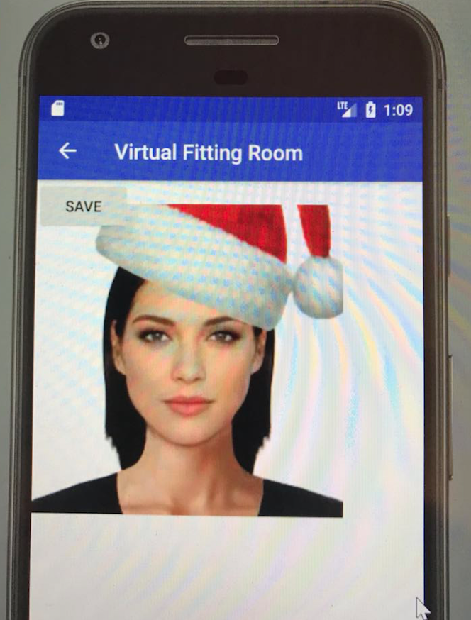

## virtual-fitting-room (for Android)

An app that helps with fitting accessaries on any of your personal pictures that has your face in it!
Matches you face in the picture and fits the chosen accessary on the right spot.

Reference:

See [dlib-android](https://github.com/tzutalin/dlib-android) for JNI lib. Refer to dlib-android/jni/jnilib_ex apache license
https://github.com/theappguruz/Android-Take-Photo-From-Camera-and-Gallery-Code-Sample Used under 
https://stackoverflow.com/questions/3528735/failed-binder-transaction-when-putting-an-bitmap-dynamically-in-a-widget
http://www.zhimengzhe.com/Androidkaifa/210791.html

### Features

* Adding accessaries to a portrait for fitting

* Saving the processed rendering to the local gallery

### Demo

### Instruction

Download and install the apk.

Choose a picture that has your face in it.

Choose an accessary picture that has been cutout.

Submit and enjoy the rendering.
